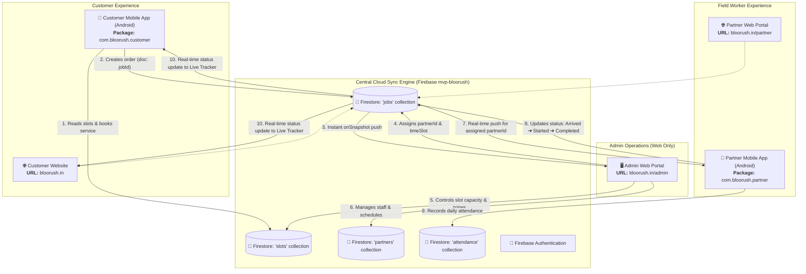
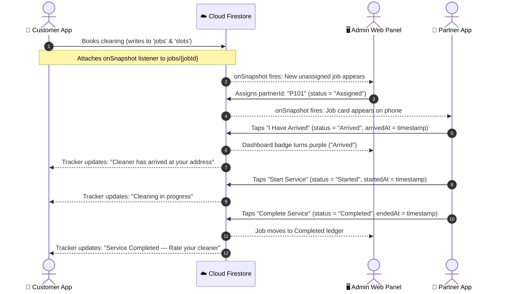

# BlooRush Ecosystem — Final Architecture Specification

## 1. Executive Summary & Ecosystem Vision

The **BlooRush Ecosystem** is a unified, on-demand home cleaning platform built for Nagpur. It connects three distinct user roles through a shared, real-time cloud data pipeline:

1. **Customer App (Mobile Android APK & Web)**: Allows homeowners and residents to browse cleaning packages, book time slots in specific Nagpur zones, complete online payments or place orders, and track cleaner arrival in real time.
2. **Partner App (Mobile Android APK)**: A high-contrast, multi-language (English, Hindi, Marathi) field app for cleaning professionals to receive dispatches, get 1-tap turn-by-turn GPS navigation, track job timers with haptic alerts, manage payment collections, and view daily earnings.
3. **Admin Operations Portal (Web Only)**: A desktop-optimized central dispatch desk (`bloorush.in/admin`) for operational managers to assign jobs, track field staff attendance, dynamically control slot capacities and service zone statuses, and audit financials.

---

## 2. High-Level System Architecture Diagram



---

## 3. Component Breakdown

### 3.1. Customer Application
* **Platforms**: Android (`bloorush_1.0.apk`), Web (`https://bloorush.in`).
* **Package ID**: `com.bloorush.customer`
* **Source Base**: [`index.html`](file:///C:/Users/hp/Documents/Bloorush_App/index.html)
* **Web Directory**: `www/`
* **Capacitor Configuration**: [`capacitor.config.json`](file:///C:/Users/hp/Documents/Bloorush_App/capacitor.config.json)
* **Key Responsibilities**:
  * Catalog browsing: Deep cleaning, bathroom, kitchen, appliance cleaning.
  * Slot reservation: Live capacity checks across Nagpur zones (Besa, Dharampeth, Manish Nagar, etc.).
  * Checkout: Razorpay UPI/Card payments with automatic fail-safe recovery.
  * Live Service Tracker: Subscribes to `doc(db, "jobs", jobId)` to track partner arrival and status live.

### 3.2. Partner Application
* **Platforms**: Android (`bloorush_partner.apk`), Web fallback.
* **Package ID**: `com.bloorush.partner`
* **Source Base**: [`partner-test/partner.html`](file:///C:/Users/hp/Documents/Bloorush_App/partner-test/partner.html), [`partner-test/partner.js`](file:///C:/Users/hp/Documents/Bloorush_App/partner-test/partner.js), [`partner-test/data.js`](file:///C:/Users/hp/Documents/Bloorush_App/partner-test/data.js)
* **Web Directory**: `www-partner/`
* **Capacitor Configuration**: `capacitor.partner.json`
* **Key Responsibilities**:
  * Phone + PIN Login: Direct authentication without complex email requirements.
  * Today's Jobs Dashboard: Real-time list of assigned jobs with customer name, phone dialer, and address.
  * 1-Tap Navigation: Opens native Google Maps navigation with exact coordinates.
  * Job Status Progression: 4-step workflow (`Assigned` ➔ `Arrived` ➔ `Started` ➔ `Completed`).
  * Service Timers & Haptics: Countdown timers with vibration and audio alerts before job end.
  * Payment Badge: Clear distinction between `🟢 Paid Online` and `🟠 Collect Cash ₹XXX`.
  * Trilingual Localization: Instant toggle between **English**, **Hindi (हिंदी)**, and **Marathi (मराठी)**.

### 3.3. Admin Operations Portal (Web Only)
* **Platform**: Web only (`bloorush.in/admin`).
* **Source Base**: [`partner-test/admin.html`](file:///C:/Users/hp/Documents/Bloorush_App/partner-test/admin.html), [`partner-test/admin.js`](file:///C:/Users/hp/Documents/Bloorush_App/partner-test/admin.js)
* **Security & Isolation**: **Strictly excluded** from both Customer and Partner APK builds.
* **Key Responsibilities**:
  * Live Dispatch: Instant audio/visual alert for new unassigned bookings.
  * Drag-and-Drop Assignment: Assign or reassign cleaning staff.
  * Staff Attendance: Check-in/out stamps, delay tracker, and daily notes.
  * Capacity Engine: Open, throttle, or expand slot limits per date and zone.
  * Emergency Zone Lockdown: Close specific zones instantly during inclement weather.

---

## 4. Real-Time Synchronization Lifecycle



---

## 5. Dual-App Repository Structure

```
Bloorush_App/
├── index.html                     # Customer Web & Mobile source
├── mobile-bridge.js               # Native Hardware Bridge (Haptics, Geolocation, Push)
├── partner-test/
│   ├── partner.html               # Partner Mobile source
│   ├── partner.js                 # Partner UI, I18N, and timers
│   ├── data.js                    # Firebase Auth & Firestore Store
│   ├── styles.css                 # Partner mobile styles
│   ├── admin.html                 # Web Admin Portal source (EXCLUDED FROM APKS)
│   └── admin.js                   # Web Admin Portal logic (EXCLUDED FROM APKS)
├── scripts/
│   ├── build-mobile.js            # Customer asset bundler -> www/
│   └── build-partner.js           # Partner asset bundler -> www-partner/
├── capacitor.config.json          # Customer config (com.bloorush.customer)
├── capacitor.partner.json         # Partner config (com.bloorush.partner)
├── android/                       # Native Android Project (Customer)
├── android-partner/               # Native Android Project (Partner)
└── .github/workflows/
    └── build-mobile.yml           # Automated Dual-APK CI/CD Build Pipeline
```

---

## 6. Build Deliverables Matrix

| Target Application | Target Platform | Package Identifier | App Display Name | Distribution Artifact |
| :--- | :--- | :--- | :--- | :--- |
| **Customer App** | Android | `com.bloorush.customer` | `BlooRush` | `bloorush_1.0.apk` / `bloorush_customer.apk` |
| **Partner App** | Android | `com.bloorush.partner` | `BlooRush Partner` | `bloorush_partner.apk` |
| **Admin Panel** | Web Only | N/A (Web) | `BlooRush Admin` | Hosted on `bloorush.in/admin` |
