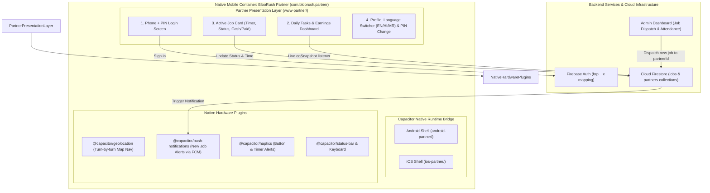
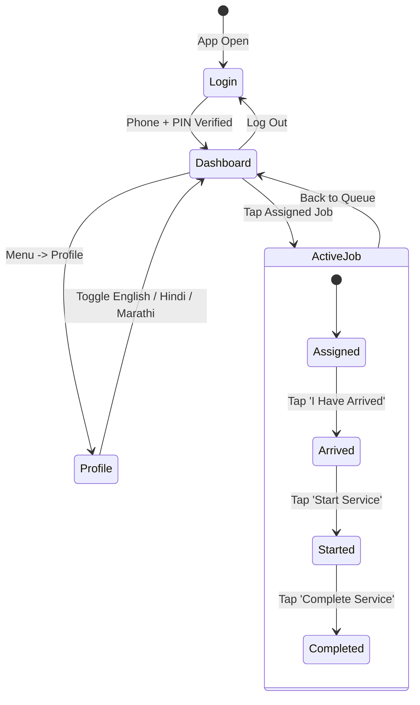

# BlooRush Partner Mobile Application — Architecture Specification

## 1. Executive Summary & Objective

The **BlooRush Partner Application** is a dedicated, field-worker-optimized mobile app designed specifically for cleaning professionals, helpers, and field partners operating across Nagpur.

Similar to delivery partner apps (Porter, Urban Company Partner, Zomato Delivery), this app provides a streamlined, high-contrast, multi-language interface allowing cleaning staff to:
1. Log in securely using only their **Phone Number & PIN**.
2. Receive real-time job dispatch notifications.
3. Access customer details and launch **1-tap turn-by-turn GPS navigation**.
4. Progress job statuses (`Assigned` ➔ `Arrived` ➔ `Started` ➔ `Completed`).
5. Track real-time service timers with audio/vibration overtime alerts.
6. Verify payment requirements (**Collect Cash** vs **Paid Online**).
7. Switch language between **English**, **Hindi (हिंदी)**, and **Marathi (मराठी)**.

---

## 2. Partner System Architecture



---

## 3. Core Screen Flows & User Experience



### Screen 1: Partner Authentication
* **Inputs**: Phone Number (`tel` input) and Numeric PIN (`password` inputmode `numeric`).
* **Behind-the-Scenes Auth**: Automatically maps `phone + PIN` into Firebase Authentication credentials (`<phone>@bloorush.app` and `brp_<pin>_x`), protecting user passwords while eliminating complicated email registration for cleaning staff.

### Screen 2: Today's Tasks & Earnings Hub
* **Daily Greeting & Hub**: Displays partner's name, active hub (e.g., *Dharampeth Hub*, *Besa Hub*), and current date.
* **Earnings Barometer**: Displays *Today's Earnings* and *Today's Orders*.
* **Live Job Queue**: Real-time Firestore snapshot listener showing all jobs assigned to this partner for the day.

### Screen 3: Interactive Job Card & Execution
* **Customer Information**: Customer name and direct phone dialer button (`tel:+91...`).
* **GPS Navigation**: One-tap launch to Google Maps turn-by-turn navigation (`https://maps.google.com/?q=<lat,lng>`).
* **Service Checklist**: Exact tasks to perform (e.g., *Utensils cleaning (2 sinks)*, *Deep toilet & bathroom cleaning*).
* **Payment Indicator**:
  - 🟢 **Paid Online**: Clear visual banner indicating *"Paid online — collect nothing"*.
  - 🟠 **Collect Cash**: Clear visual banner displaying exact cash amount to collect from the customer upon completion.
* **Service Timer & Vibration Alerts**:
  - Displays countdown timer for expected service duration.
  - Triggers audio beeps and native haptic vibrations when service time warning threshold is reached.

### Screen 4: Multilingual Support & Profile
* **Languages Supported**:
  - English (`en`)
  - Hindi (`hi`) — *"नमस्ते", "आज की कमाई", "काम शुरू करें", "काम पूरा करें"*
  - Marathi (`mr`) — *"नमस्कार", "आजची कमाई", "काम सुरू करा", "काम पूर्ण करा"*
* **Security**: Self-service PIN change capability directly from the mobile app.

---

## 4. Dual-App Repository Architecture

To maintain both the **Customer App** and **Partner App** in a single codebase cleanly without code conflicts:

```
Bloorush_App/
├── index.html                     # Customer Web & Mobile source
├── partner-test/
│   ├── partner.html               # Partner Mobile source
│   ├── partner.js                 # Partner UI & I18N logic
│   ├── data.js                    # Firebase Auth & Firestore Store
│   └── styles.css                 # Partner styling
├── scripts/
│   ├── build-mobile.js            # Packages Customer app into www/
│   └── build-partner.js           # Packages Partner app into www-partner/
├── capacitor.config.json          # Customer App Config (com.bloorush.customer)
├── capacitor.partner.json         # Partner App Config (com.bloorush.partner)
├── android/                       # Customer Android Project
├── android-partner/               # Partner Android Project
└── .github/workflows/
    └── build-mobile.yml           # Compiles both Customer & Partner APKs
```

---

## 5. Build Artifact Deliverables

| Target App | Package Identifier | App Display Name | Generated Artifact |
| :--- | :--- | :--- | :--- |
| **Customer App** | `com.bloorush.customer` | `BlooRush` | `bloorush_customer.apk` |
| **Partner App** | `com.bloorush.partner` | `BlooRush Partner` | `bloorush_partner.apk` |

---

## 6. Execution Roadmap for Partner App

1. **Step 1 (Asset Isolation)**: Create `scripts/build-partner.js` to assemble only partner assets into a dedicated `www-partner/` build directory.
2. **Step 2 (Configuration)**: Create `capacitor.partner.json` with App ID `com.bloorush.partner` and Name `BlooRush Partner`.
3. **Step 3 (Android Partner Container)**: Generate `android-partner/` native project.
4. **Step 4 (Native Bridge)**: Link `mobile-bridge.js` to provide native GPS and push alerts.
5. **Step 5 (Dual CI/CD Build)**: Update `.github/workflows/build-mobile.yml` so GitHub Actions automatically compiles and outputs both `bloorush_customer.apk` and `bloorush_partner.apk` concurrently!
