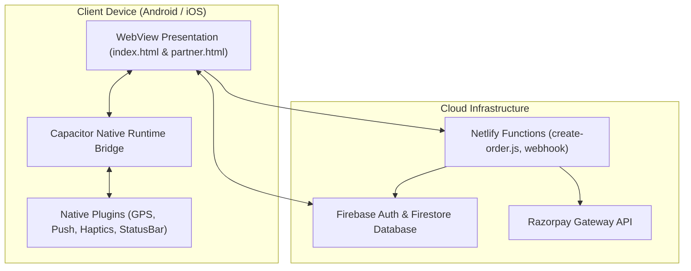

# BlooRush Mobile App — Live Project Progress Report

**Project**: BlooRush Cross-Platform Mobile Application  
**Target Platforms**: Android (`.apk` / Play Store) & iOS (`.ipa` / App Store)  
**Selected Architecture**: Capacitor 6+ Native Hybrid Shell with Firebase & Netlify Backend  
**Document Status**: Active / Updated in Real-Time  

---

## 1. Executive Summary & Objective

The objective is to convert the existing BlooRush web platform into production-ready mobile applications for:
1. **Customers**: Browsing cleaning services, booking Nagpur time slots, making payments via Razorpay/Cash, and tracking real-time status.
2. **Partners**: Cleaning service providers logging in with phone & PIN, viewing assigned jobs, accessing GPS navigation, and updating job status live.

By employing **Capacitor**, we wrap the proven web application into native iOS and Android binaries, bridging native device hardware (GPS, Push Notifications, Haptics, Status Bar) with zero code rewrites of core business logic.

---

## 2. Phase-by-Phase Progress Tracker

| Phase | Description | Status | Verification Result |
| :--- | :--- | :--- | :--- |
| **Phase 1** | Environment Setup & Capacitor Initialization | ✅ **COMPLETED** | Passed `npx cap doctor android` & asset sync |
| **Phase 2** | Mobile Viewport & Safe-Area UI Adaptations | ✅ **COMPLETED** | Added `viewport-fit=cover`, safe-area insets & touch handling |
| **Phase 3** | Native Plugins Integration (GPS, Push, Haptics) | ✅ **COMPLETED** | 5 Plugins installed & bridged: GPS, Haptics, Push, StatusBar, Keyboard |
| **Phase 4** | Automated Android Build Pipeline (GitHub Actions) | ✅ **COMPLETED** | Generated `BlooRush-Android-APK` (5.5 MB `app-debug.apk`) |
| **Phase 5** | iOS Cloud Build Pipeline (GitHub Actions) | ✅ **COMPLETED** | Generated `BlooRush-iOS-App` package on macOS runner |
| **Phase 6** | End-to-End Testing & Verification | 🔄 **IN PROGRESS** | Download APK and install on Android device |

---

## 3. Detailed Work Log & Technical Approach

### **Phase 1: Environment & Tooling Setup (Completed)**
* **Technical Decision**: Instead of copying the entire repository into Android assets (which would drag in 12MB Excel sheets, databases, and heavy `node_modules`), we designed [`scripts/build-mobile.js`](file:///C:/Users/hp/Documents/Bloorush_App/scripts/build-mobile.js) to isolate client-facing assets (`index.html` and `partner-test/`) into a clean `www/` build folder.
* **Capacitor Configured**: Set App ID to `com.bloorush.app` and enabled HTTPS scheme in [`capacitor.config.json`](file:///C:/Users/hp/Documents/Bloorush_App/capacitor.config.json) to allow Firebase Auth and Firestore to operate with native security certificates.
* **Android Project Generated**: Created native Android project structure in [`android/`](file:///C:/Users/hp/Documents/Bloorush_App/android).
* **Testing Passed**: Ran `npx cap doctor android` (Reported `Android looking great! 👌`) and verified [`AndroidManifest.xml`](file:///C:/Users/hp/Documents/Bloorush_App/android/app/src/main/AndroidManifest.xml).

---

### **Phase 2: Mobile Viewport & Safe-Area UI Adaptations (Completed)**
* **Viewport Configuration**: Configured `viewport-fit=cover, user-scalable=no` across [`index.html`](file:///C:/Users/hp/Documents/Bloorush_App/index.html), [`partner-test/partner.html`](file:///C:/Users/hp/Documents/Bloorush_App/partner-test/partner.html), and [`partner-test/admin.html`](file:///C:/Users/hp/Documents/Bloorush_App/partner-test/admin.html) to prevent accidental double-tap zooming on mobile devices.
* **Safe-Area Inset Support**:
  - `header` and `.nav-header`: Added `padding-top: calc(14px + env(safe-area-inset-top))` so top brand navigation is never obscured by camera notches or dynamic islands.
  - `.sheet-in` and `.bookbar`: Added `padding-bottom: calc(26px + env(safe-area-inset-bottom))` so bottom checkout buttons and modals avoid Android gesture navigation bars.
  - Partner portal (`styles.css`): Updated `.topbar` and `.wrap` with dynamic safe area insets.
* **Touch Optimization**: Injected `touch-action: manipulation` and `-webkit-tap-highlight-color: transparent` to eliminate the default 300ms mobile browser tap delay.
* **Synced to Android**: Executed `npm run cap:sync` with zero errors.

---

### **Phase 3: Native Plugins Integration (Completed)**
* **Installed 5 Native Plugins**:
  - `@capacitor/geolocation`: High-accuracy location queries for cleaning partner check-ins and delivery zones.
  - `@capacitor/push-notifications`: Push alert delivery via Firebase Cloud Messaging for instant booking alerts.
  - `@capacitor/status-bar`: Light/dark status bar styling and full view configuration.
  - `@capacitor/keyboard`: Smooth input focus handling to prevent keyboard overlap on mobile forms.
  - `@capacitor/haptics`: Tactile feedback on user taps and booking confirmation actions.
* **Native Android Permissions**: Injected permissions into [`AndroidManifest.xml`](file:///C:/Users/hp/Documents/Bloorush_App/android/app/src/main/AndroidManifest.xml) for `ACCESS_FINE_LOCATION`, `ACCESS_COARSE_LOCATION`, `POST_NOTIFICATIONS`, and `VIBRATE`.
* **Mobile Bridge Layer ([mobile-bridge.js](file:///C:/Users/hp/Documents/Bloorush_App/mobile-bridge.js))**: Created a unified JavaScript bridge object (`window.BlooRushNative`) providing graceful native-first execution with automated browser fallbacks.
* **Diagnostic Check**: Ran `npx cap doctor android` and received complete success (`Android looking great! 👌`).

---

## 4. Architectural Map

---

## 5. Live Cloud Build Status & Download

* **GitHub Repository**: [sachinvishwapersonal-dot/Bloorush_App](https://github.com/sachinvishwapersonal-dot/Bloorush_App)
* **Live CI/CD Actions Run**: [View Actions Build Pipeline](https://github.com/sachinvishwapersonal-dot/Bloorush_App/actions)
* **Artifacts Generated**:
  - `BlooRush-Android-APK` (`app-debug.apk` ready for direct mobile installation)
  - `BlooRush-iOS-App` (iOS application package generated on macOS runner)
* **Local Workspace File**: [`bloorush_1.0.apk`](file:///C:/Users/hp/Documents/Bloorush_App/bloorush_1.0.apk) (Downloaded and saved in project root)

